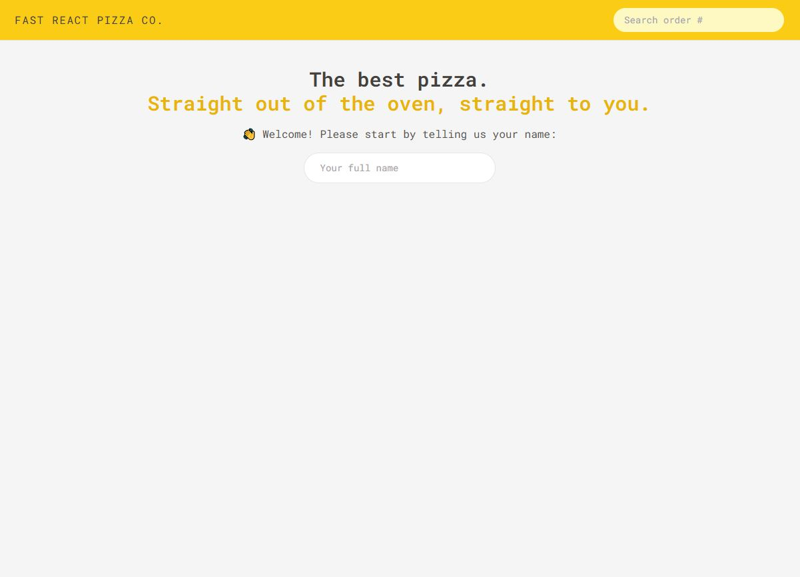
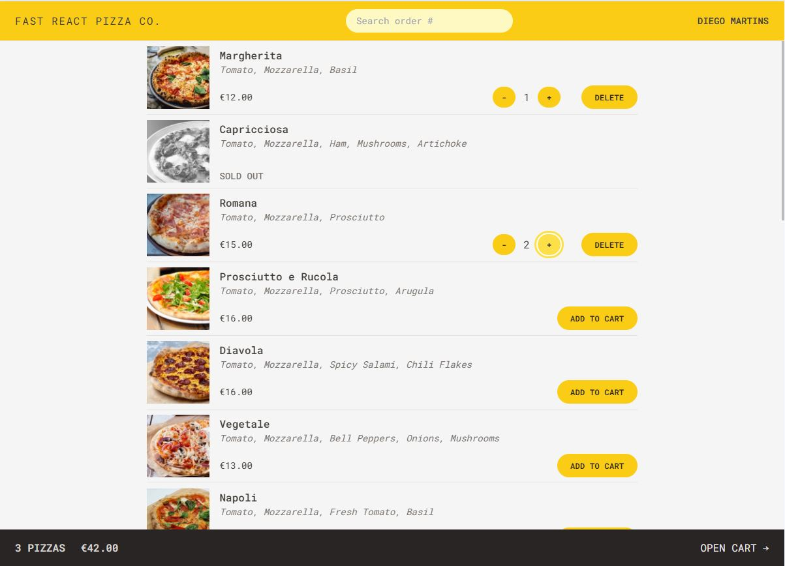
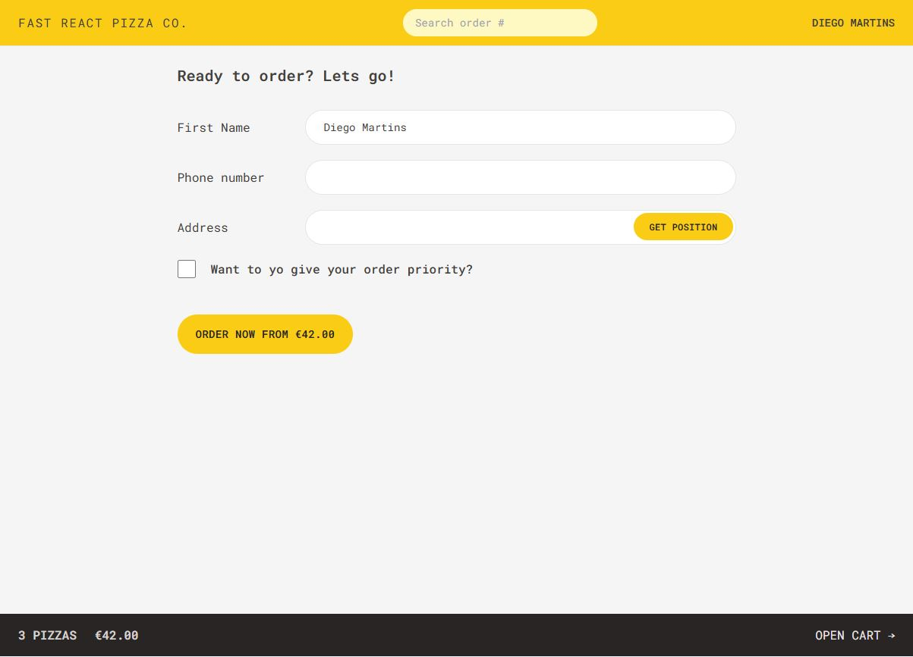
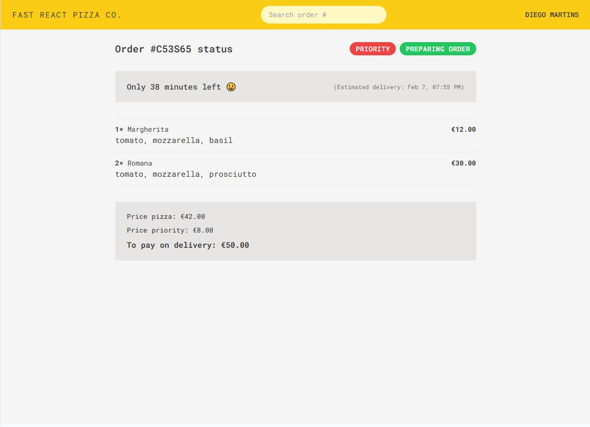

# 🍕 Pizza Ordering System

This is a React-based pizza ordering system designed to help users browse a menu of pizzas, add them to a cart, and place an order seamlessly. The project was built to learn and apply modern React development techniques.

## 🚀 Technologies Used

- **React** with Vite for a fast and optimized development environment
- **Tailwind CSS** for styling
- **Redux Toolkit** for state management
- **Redux Thunks** for handling asynchronous actions
- **React Router** with Actions and Loaders for efficient data fetching and routing

## 📌 Features

- Browse a variety of pizzas from the menu
- Add or remove pizzas from the shopping cart
- View real-time updates in the cart
- Place an order with a seamless checkout process
- Optimized state management using Redux Toolkit
- Efficient data handling with Redux Thunks and React Router loaders

## 📸 Screenshots

### Welcome Page



### Pizza Menu Page



### Order Confirmation Page



### Order Status Page



## 🔧 Installation & Setup

To get started with the project, follow these steps:

1. Clone the repository:
   ```sh
   git clone https://github.com/dcvieira/fast-react-pizza.git
   ```
2. Navigate to the project directory:
   ```sh
   cd fast-react-pizza
   ```
3. Install dependencies:
   ```sh
   npm install
   ```
4. Start the development server:
   ```sh
   npm run dev
   ```
5. Open your browser and navigate to `http://localhost:5173/`

## 📂 Project Structure

```
├── src
│   ├── components  # Reusable UI components
│   ├── pages       # Application pages
│   ├── store       # Redux store configuration
│   ├── features    # Redux slices
│   ├── routes      # React Router configuration
│   ├── assets      # Static assets (images, icons, etc.)
│   ├── hooks       # Custom hooks
│   ├── utils       # Helper functions
│   ├── App.jsx     # Main application component
│   ├── main.jsx    # Entry point
│   ├── index.css   # Global styles
```

```
├── src
│   ├── ui             # Reusable UI components
│   ├── services       # API Services
│   ├── features       # App Features components and Redux slices
│       ├── cart
│       ├── menu
│       ├── order
│       ├── user
│   ├── utils          # Helper functions
│   ├── App.jsx        # Main application component
│   ├── main.jsx       # Entry point
│   ├── stores.js      # Redux store configuration
│   ├── index.css      # Global styles
```

## 🛠 Future Improvements

- Implement user authentication and order history
- Enhance UI/UX with animations
- Integrate a backend for real order processing
- Add unit and integration tests

## 🤝 Contributing

Contributions are welcome! If you'd like to improve the project, feel free to fork the repository and submit a pull request.

## 📜 License

This project is open-source and available under the [MIT License](LICENSE).

Happy coding! 🚀
